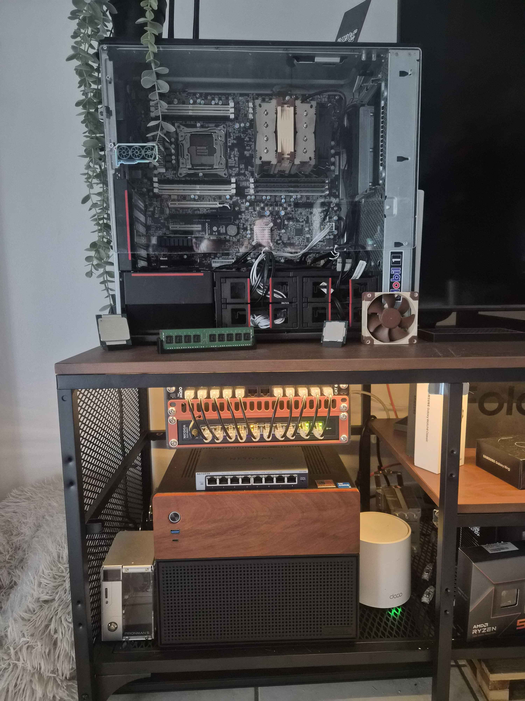

# 💾 HomeLab Setup

> Last update: 2026-08-16

This repository contains the configuration for my home lab. It's running two Proxmox nodes VE 9.2.10.

It's also a way for me to document my setup and be able to recreate it if needed, with all the helpfull commands and ressources (doc, videos) I used.

## Schematics

To be done

---

# Vue d'ensemble

Cluster Proxmox : `HomeCluster` (pve-home + pve-nas)

## Convention de nommage

Le dernier octet de l'IP correspond au VMID : `1xx` → `.1x` · `2xx` → `.2x` · `4xx` → `.4x` · `5xx` → `.5x`

| Plage   | Usage           |
| ------- | --------------- |
| .10–.19 | Réseau / entrée |
| .20–.29 | NAS et stockage |
| .40–.49 | Quotidien       |
| .50–.59 | Compute         |
| .60–.69 | Bac à sable     |

## Services

### Réseau -.10 à .19

| IP  | Service             | ID  | Hôte |
| --- | ------------------- | --- | ---- |
| .10 | Tailscale           | 110 | P700 |
| .11 | Pi-hole             | 111 | P700 |
| .12 | Nginx Proxy Manager | 112 | P700 |
| .13 | Authentik           | 113 | P700 |
| .14 | Monitoring          | 114 | P700 |
| .15 | Dashboard           | 115 | P700 |
| .16 | MySpeed             | 116 | P700 |

### NAS -.20 à .29

| IP  | Service        | ID  | Hôte |
| --- | -------------- | --- | ---- |
| .20 | TrueNAS        | 200 | NAS  |
| .21 | TrueNAS Backup | 201 | P700 |
| .22 | Nextcloud      | 202 | NAS  |
| .23 | Immich         | 203 | NAS  |
| .24 | Jellyfin       | 204 | NAS  |
| .25 | PostgreSQL     | 205 | NAS  |
| .26 | Snapfilething  | 206 | NAS  |
| .27 | Outline        | 207 | NAS  |
| .28 | Arr\* Stack    | 208 | NAS  |

### Quotidien -.40 à .49

| IP  | Service         | ID  | Hôte |
| --- | --------------- | --- | ---- |
| .40 | Home Assistant  | 400 | P700 |
| .42 | PDF Converter   | 402 | P700 |
| .43 | Alpine IT Tools | 403 | P700 |
| .44 | urspotify       | 404 | P700 |

### Compute -.50 à .59

| IP  | Service                 | ID  | Hôte |
| --- | ----------------------- | --- | ---- |
| .50 | WebHost                 | 500 | P700 |
| .51 | GitHub runner / Dokploy | 501 | P700 |
| .53 | AlgoHive                | 503 | P700 |
| .55 | Crafty                  | 505 | P700 |

### Bac à sable -.60 à .69

Windows, K3s, Arch, LLM, etc.

## Réseau

- Pi-hole `.11` : résolution `.lan` + records locaux
- NPM `.12` : reverse proxy, certificat wildcard `*.ndd.xyz`
- Certificats : Let's Encrypt via challenge DNS Cloudflare

## Stockage

**Pool** `**tank**` (TrueNAS `.20`) -RAIDZ1 3× 4 To ≈ 7,2 Tio

Datasets :

- `tank/apps/immich` → répliqué
- `tank/apps/nextcloud` → répliqué
- `tank/media` → non répliqué, recordsize 1M

Partages NFS montés sur pve-nas : `/mnt/tank-apps`, `/mnt/tank-media` Options fstab : `nfs4 defaults,_netdev,noatime,hard`

**Principe** : données importantes sur `tank`, bases de données sur le disque local des VMs avec dump `pg_dump` vers `tank` (donc répliqué).

## Authentification

Authentik `.13` -OIDC pour Immich, Nextcloud, Outline

Redirect URIs par service :

- Immich : `/auth/login`, `/user-settings`, `app.immich:///oauth-callback`
- Nextcloud : `/apps/user_oidc/code`
- Outline : `/auth/oidc.callback`

## Maintenance

- **Snapshots** : `tank/apps` récursif, quotidien, rétention 1 mois
- **Scrub** : `tank`, dimanche 00h00, seuil 35 jours
- **SMART** : court hebdomadaire (dim 02h), long mensuel (jour 2, 03h) -via cron, l'UI a été retirée en 25.10
- **Mail** : relais Brevo (`smtp-relay.brevo.com:587`), port 25 bloqué par le FAI

## Servers Configuration

### HomeLab - Power Server

- **Server**: Lenovo ThinkStation P700
- **CPU**: 1x Intel Xeon E5-2650L v3 @ 24x1.80GHz
- **RAM**: 48GB DDR4 ECC
- **Storage**: 1x 256GB SSD + 3x 1TB Samsung 860 EVO SSD
- **Network**: 2.5Gbps NIC + 2x 1Gbps Ethernet
- **Power**: 700W Platinum PSU
- **TDP**: 135W
- **Idle Power**: 45W
- **OS**: Proxmox VE 8.2.4

### HomeLab - NAS

- **Server**: Home made NAS
- **Case**: Jonsbo N4
- **HBA**: LSI 9223 9200 9240-8i HBA FW:P20 9211-8i IT
- **Disks**: WD40EFRX Red (3x4To)
- **Power Supply**: be quiet! SFX Power 3 450 W, 80 Plus Bronze
- **Motherboard**: MSI MAG B660M Mortar WiFi DDR4
- **RAM**: Kingston 8GB PC4-2400T-UA2-11 (8x4)
- **CPU**: I5 12400
- **SSD (Storage)**: 2x Kingston ssd 256Gb
- **CPU Cooler**: Noctua NH-L9x65
